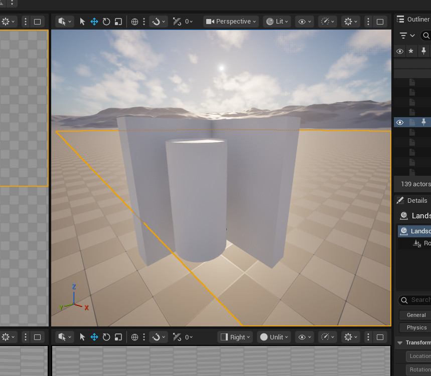
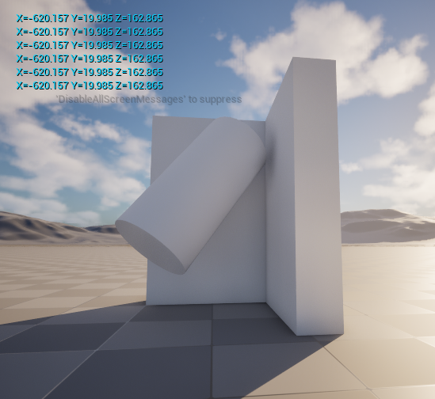
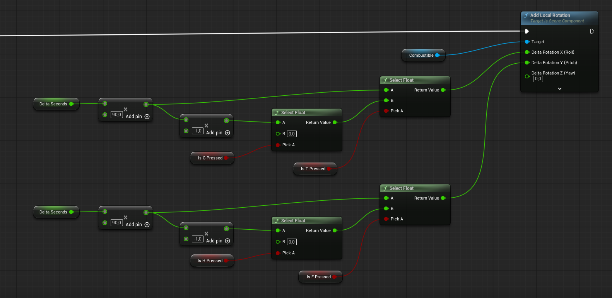

+++
title = 'Rocket Project: Mounting the Engine and Making Its Direction Controllable'
date = 2026-08-14T00:00:00+09:00
draft = false
tags = ['Unreal Engine', 'Simulation', 'Hardware', 'Personal Project']
summary = "Attaching the engine to the rocket body in Unreal Engine and giving it a controllable gimbal so its thrust direction can be steered."

[cover]
  image = "engine-tilted.png"
  alt = "Blueprint graph reading key states and applying local rotation to the engine"
  hiddenInSingle = true
+++

With the [thrust curve driving the engine's force](/posts/rocket-solid-engine-simulation/), the next step was to mount the engine inside the rocket body and let its orientation move independently of the airframe — the first piece of thrust-vector control.

At rest, the engine sits centered inside the body, pointed straight along the rocket's main axis.

Pressing **T**, **F**, **G** or **H** tilts the engine on its pitch or roll axis while the body stays fixed, simulating a gimbaled mount that can redirect thrust away from the rocket's centerline.

Under the hood, each key press is read as a boolean and combined with delta time to build a signed rotation rate: T/G steer pitch, F/H steer roll, each pair picking a positive or negative rate via `Select Float` nodes so the engine only rotates while a key is held. The resulting values are fed into `Add Local Rotation` on the engine mesh every tick, rotating it relative to the body it's mounted in.

This is part of the broader [Hardware & Modeling for Rocket Launches](/posts/rocket-launch-project/) project.

**Source:** [github.com/Potoman/RocketSimulation](https://github.com/Potoman/RocketSimulation)

*Status: active, ongoing.*
