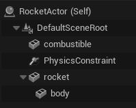
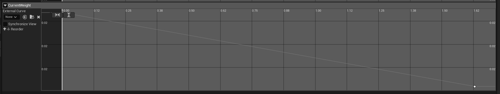
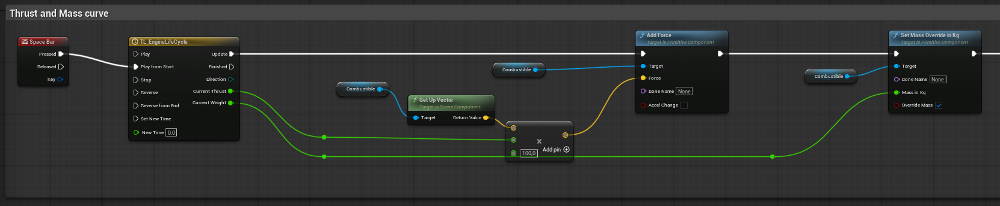
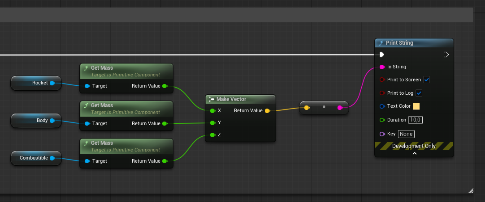

+++
title = 'Rocket Project: Physics-Driven Engine Mass and a Constraint-Based Gimbal'
date = 2026-08-16T00:00:00+09:00
draft = false
type = 'posts'
tags = ['Unreal Engine', 'Simulation', 'Hardware', 'Personal Project']
summary = "Reworking the gimbal around a Physics Constraint so the engine can carry its own mass, and making that mass drop as the engine burns."
[cover]
  image = "component-tree.png"
  alt = "Component tree with the combustible engine and rocket body joined by a Physics Constraint"
  hiddenInSingle = true
+++

The [first version of the gimbal](/projects/rocket-launch-project/rocket-engine-gimbal/) rotated the engine mesh with `Add Local Rotation` while it stayed welded to the rocket body. That's fine for orientation, but it breaks down as soon as the engine needs its own mass: Unreal Engine only lets a component report an independent mass when it's simulating physics on its own, and a welded component isn't independent, it's fused into its parent's body.

Simulating physics on the engine means it can no longer be a child welded to the body, it has to be a separate component. So the engine (`combustible`) was pulled out from under `rocket > body` and reattached with a **Physics Constraint**, which holds the two together while only allowing the engine to rotate relative to the body, exactly the freedom the gimbal needs.

With the engine now physically independent, its mass can change over time instead of staying fixed. The `TL_EngineLifeCycle` timeline that already drove the thrust curve now also drives a `Current Weight` track, decreasing as the engine burns.

Every tick, `Current Thrust` still feeds `Add Force` on the combustible, and `Current Weight` now feeds `Set Mass Override in Kg` on the same component, so the simulated mass follows the burn instead of staying constant.

To keep an eye on that mass while testing, a small logging graph reads `Get Mass` on the rocket, the body and the combustible, packs the three values into a vector, and prints them to screen and log whenever it's triggered.

This is part of the broader [Hardware & Modeling for Rocket Launches](/projects/rocket-launch-project/) project.

**Source:** [github.com/Potoman/RocketSimulation](https://github.com/Potoman/RocketSimulation)

*Status: active, ongoing.*
