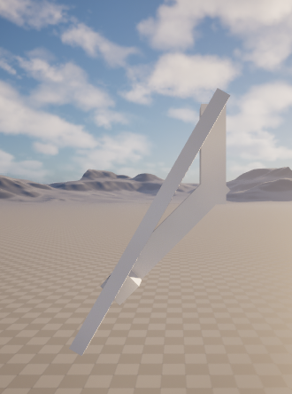
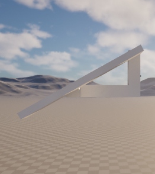

+++
title = 'Rocket Project: A Rotule-and-Slider Mechanism for the Landing Legs'
date = 2026-08-21T00:00:00+09:00
draft = false
type = 'posts'
tags = ['Unreal Engine', 'Simulation', 'Hardware', 'Personal Project']
summary = "Prototyping a ball-joint-plus-slider physics constraint to deploy the rocket's landing legs, from folded to fully extended."
[cover]
  image = "leg-deploy-90.png"
  alt = "Landing leg fully deployed at a right angle to the rocket body"
  hiddenInSingle = true
+++

Today's focus was the physics constraints needed to simulate the rocket's landing legs. The goal is a joint that combines a rotule (ball-and-socket) with a translation, so a leg can both swing out from the body and slide along its own length as it deploys, rather than pivoting on a single rigid hinge.

Pushed further, the same constraint carries the leg all the way out to its extended position, locked flat against the body at a right angle.

The rotation and slide are working; what's still open is the elasticity. Unreal's Physics Constraint may not be enough to give the leg a spring-like give on touchdown, and that might end up needing a Blueprint-driven damped spring instead. Still to be figured out.

This is part of the broader [Hardware & Modeling for Rocket Launches](/projects/rocket-launch-project/) project.

**Source:** [github.com/Potoman/RocketSimulation](https://github.com/Potoman/RocketSimulation)

*Status: active, ongoing.*
