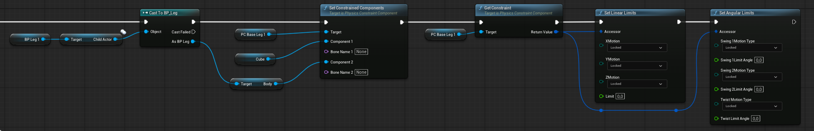
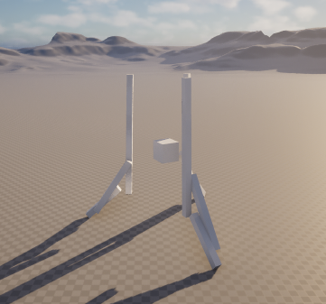

+++
title = 'Rocket Project: Spring-and-Damper Constraints for the Landing Legs'
date = 2026-08-23T00:00:00+09:00
draft = false
type = 'posts'
tags = ['Unreal Engine', 'Simulation', 'Hardware', 'Personal Project']
summary = "Wiring up a Physics Constraint between the body and each landing leg, with a spring and damper to absorb the impact on touchdown."
[cover]
  image = "tripod.png"
  alt = "The rocket standing on its three deployed landing legs"
  hiddenInSingle = true
+++

Following up on the [rotule-and-slider deployment mechanism](/projects/rocket-launch-project/rocket-landing-leg-deployment/), today's work was setting up the Physics Constraint that actually attaches each leg to the rocket's body.

Each leg is its own Actor, kept separate from the body so the schematics stay factorized and reusable. That separation means the constraint can't just be wired up in the body's own Blueprint: it has to reach into the leg Actor and search for the right mesh component before it can bind that mesh to the body with a Physics Constraint.

That lookup-and-constrain logic gets repeated three times, once per leg. It's already begging to be pulled into its own function instead of copy-pasting the same nodes three times, that would simplify the Blueprint a lot, and it's the next cleanup on the list.

With all three legs constrained, each one carries a spring and a damper along its length, so the tripod can absorb some of the impact on touchdown instead of transmitting it straight into the body.

The result is a bit underwhelming though: the constraint on each leg lets parts move relative to each other more than expected, and there's a visible jitter instead of a clean, damped settle. Tracking that down is next.

This is part of the broader [Hardware & Modeling for Rocket Launches](/projects/rocket-launch-project/) project.

**Source:** [github.com/Potoman/RocketSimulation](https://github.com/Potoman/RocketSimulation)

*Status: active, ongoing.*
