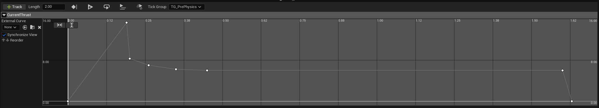
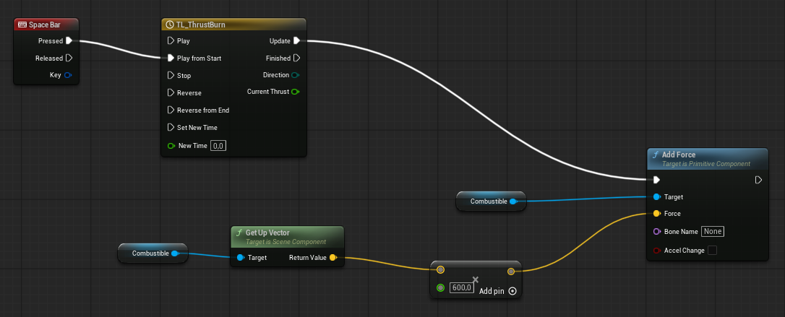

+++
title = 'Rocket Project: Solid Engine Simulation'
date = 2026-08-12T00:00:00+09:00
draft = false
type = 'posts'
tags = ['Unreal Engine', 'Simulation', 'Hardware', 'Personal Project']
summary = "Simulating a solid rocket motor's thrust profile in Unreal Engine as part of my rocket launch project."

[cover]
  image = "thrust-blueprint.png"
  alt = "Blueprint graph applying thrust from a timeline-driven curve"
  hiddenInSingle = true
+++

A solid rocket motor can't be throttled: its thrust over time is fixed by the propellant grain's geometry, burning hard right after ignition and tapering off as it burns down. To validate flight dynamics before any real launch, I'm modeling that thrust profile in Unreal Engine and driving the physics simulation from it.

The thrust curve is authored as a timeline curve asset, shaped like a real solid-motor burn: a sharp spike at ignition, then a decaying tail.

On Space Bar press, a Blueprint plays that timeline and, every tick, reads the current thrust value and applies it as a physics force along the rocket body's up vector — turning the authored curve directly into acceleration in the simulation.

This is part of the broader [Hardware & Modeling for Rocket Launches](/projects/rocket-launch-project/) project.

**Source:** [github.com/Potoman/RocketSimulation](https://github.com/Potoman/RocketSimulation)

*Status: active, ongoing.*
